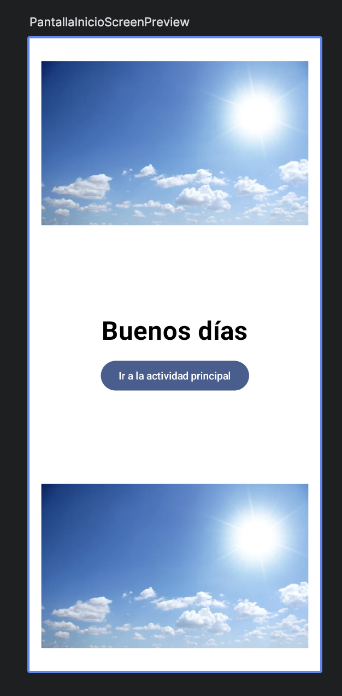
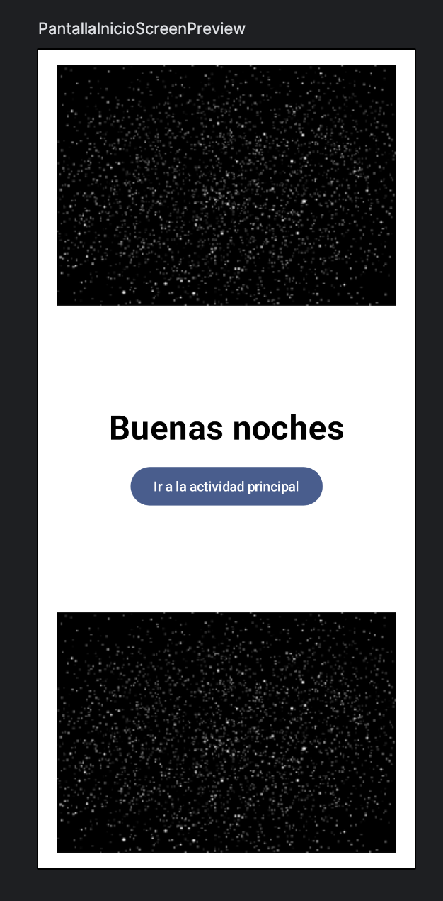
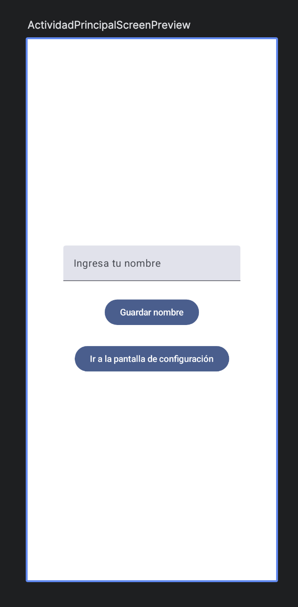
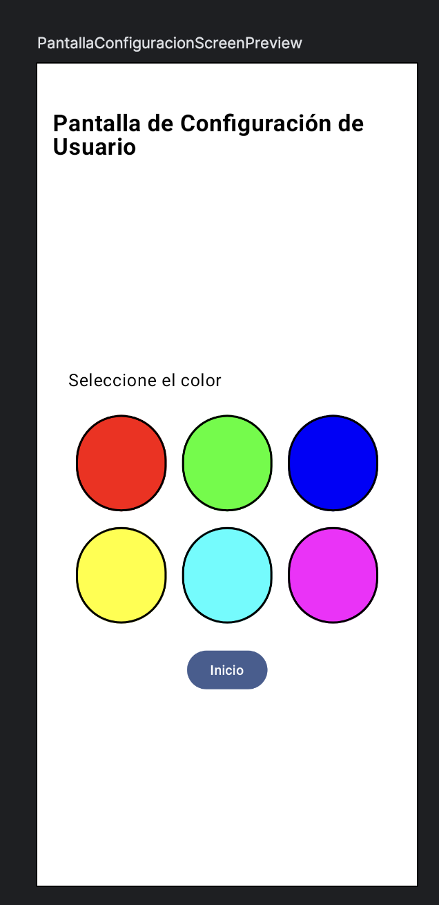
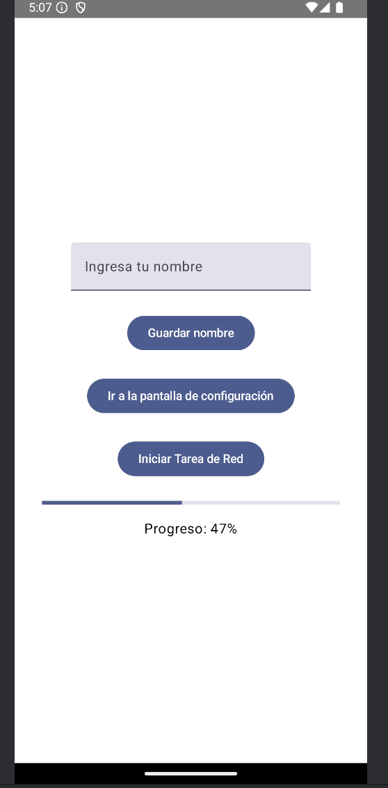

# Proyecto Taller 2

## Enlace al Repositorio

[Repositorio en GitHub](https://github.com/jmartter/Taller_2.git)

Este proyecto es una aplicación de Android, la aplicación está compuesta por tres pantallas diferentes: `PantallaInicio`, `ActividadPrincipal` y `PantallaConfiguracion`.

## Ubicación del Código 

El código de este proyecto se encuentra en la siguiente ruta:

`/Taller_2/src/main/java/com/example/taller_1/estructura/`

## Componentes Principales

### `PantallaInicio.kt`

1. **Clase `PantallaInicio`**:
   - Es una subclase de `ComponentActivity`.
   - En el método `onCreate`, se configura la pantalla de inicio usando Jetpack Compose.
   - Se pasa un color seleccionado a la pantalla de inicio.

2. **Función `PantallaInicioScreen`**:
   - Es una función composable que define la UI de la pantalla de inicio.
   - Usa `getGreetingMessage` para obtener un mensaje de saludo basado en la hora del día.
   - Usa `Image` para mostrar una imagen de banner.
   - Usa `Button` para navegar a la actividad principal.

3. **Función `PantallaInicioScreenPreview`**:
   - Es una función composable que proporciona una vista previa de la pantalla de inicio en el editor.

Muestra de la pantalla de inicio:

|  |  |

### `ActividadPrincipal.kt`

1. **Clase `ActividadPrincipal`**:
   - Es una subclase de `ComponentActivity`.
   - En el método `onCreate`, se configura la pantalla principal usando Jetpack Compose.
   - Se pasa un color seleccionado a la pantalla principal.

2. **Función `ActividadPrincipalScreen`**:
   - Es una función composable que define la UI de la pantalla principal.
   - Usa `remember` para mantener el estado del nombre y el saludo.
   - Usa `TextField` para ingresar el nombre.
   - Usa `Button` para guardar el nombre en `SharedPreferences` y actualizar el saludo.
   - Usa `Button` para navegar a la pantalla de configuración.
   - Usa `Button` para iniciar una tarea de red simulada y mostrar el progreso.

3. **Función `ActividadPrincipalScreenPreview`**:
   - Es una función composable que proporciona una vista previa de la pantalla principal en el editor.

Muestra de la pantalla de Actividad Principal:

### `PantallaConfiguracion.kt`

1. **Clase `PantallaConfiguracion`**:
   - Es una subclase de `ComponentActivity`.
   - En el método `onCreate`, se configura la pantalla de configuración usando Jetpack Compose.
   - Se pasa un color seleccionado a la pantalla de configuración.

2. **Función `PantallaConfiguracionScreen`**:
   - Es una función composable que define la UI de la pantalla de configuración.
   - Usa `remember` para mantener el estado del color seleccionado.
   - Recupera el nombre guardado de `SharedPreferences`.
   - Muestra el nombre guardado en un `Text`.
   - Usa `LazyVerticalGrid` para mostrar una cuadrícula de colores seleccionables.
   - Usa `Button` para navegar de vuelta a la pantalla de inicio.

3. **Función `ColorCircle`**:
   - Es una función composable que define un círculo de color clicable.
   - Usa `Box` para crear un círculo con un borde y un color de fondo.

4. **Función `PantallaConfiguracionScreenPreview`**:
   - Es una función composable que proporciona una vista previa de la pantalla de configuración en el editor.

Muestra de la pantalla de Configuración:

### Incorporaciones Recientes

1. **Uso de `AsyncTask` y `AsyncTaskLoader` en `MainActivity`**:
   - Se ha añadido el uso de `AsyncTask` (`LoadMenuTask`) para cargar menús en segundo plano.
   - Se ha añadido el uso de `AsyncTaskLoader` (`MenuLoader`) para cargar menús en segundo plano.

2. **Clase `LoadMenuTask`**:
   - Es una subclase de `AsyncTask` que simula la carga de menús en segundo plano.

3. **Clase `MenuLoader`**:
   - Es una subclase de `AsyncTaskLoader` que simula la carga de menús en segundo plano.

4. **Clase `NetworkTask`**:
   - Es una subclase de `AsyncTask` que simula una tarea de red y actualiza el progreso.

Estas incorporaciones permiten cargar datos en segundo plano y mejorar la experiencia del usuario al no bloquear la interfaz de usuario principal.

### Nueva Imagen

Muestra de la pantalla de descarga:

